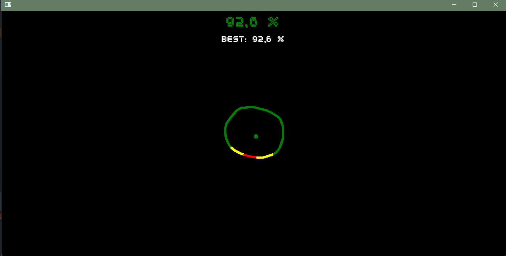

# Perfect_Cirlce
nFactorial Incubator 2023 task

### Об игре

* Моя игра была написана на Java и JavaFX.
  * Логика игры - Java
  * Дизайн - JavaFX
***
* Смысл игры заключается в том, чтобы игрок нарисовал, насколько это возможно, идеальный круг

***

### Как запускать игру?
* Мне удалось открыть игру как jar файл, но для этого нужно чтобы у вас был загружен на компьютер JavaFX.
* Пожалуйста, склонируйте проект с GitHub и запустите на Intellij Idea
* Если у вас не будет установлен JavaFX, то проект не запуститься на вашем устройстве.
***

### Главный баг в игре
* Игра недоработанная, есть баг при рисовании круга.
  * Программа высчитывает сколько раз вы прошли через линию, которую сама же высчитывает, и если вы прошли через эту линию 2 раза то круг считается завершенным.
И баг состоит в том, что программа может сразу за пол круга сосчитать, что вы прошли два раза через эту линию и посчитает, что круг завершенный.